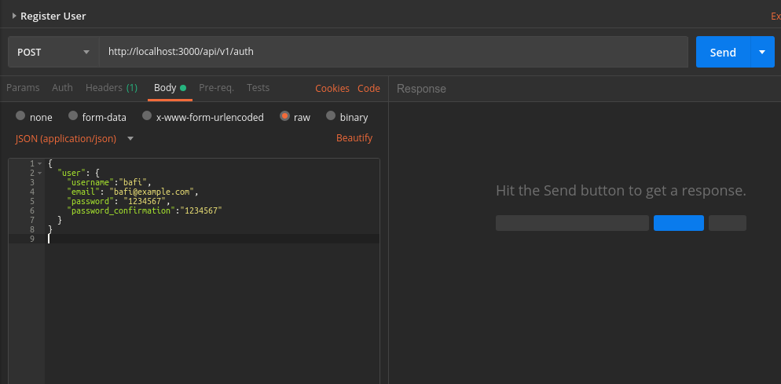
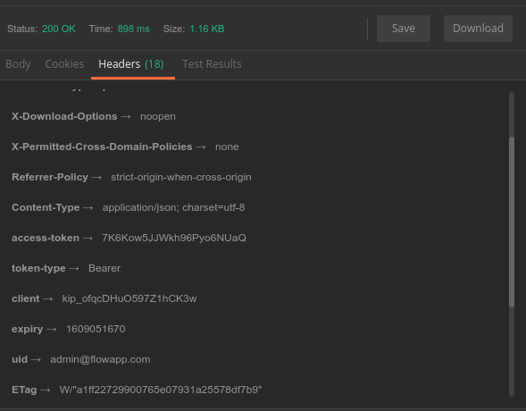
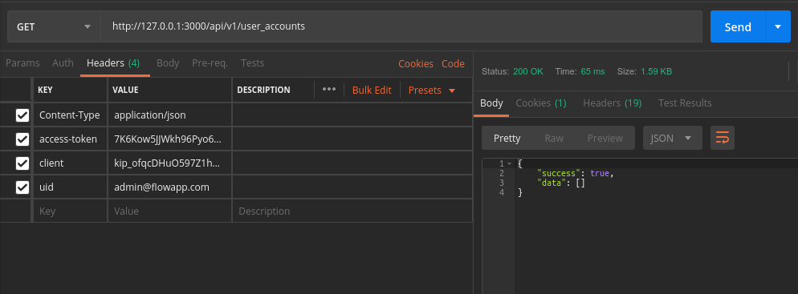

[](https://gitmoji.dev) [](https://github.com/rubocop-hq/rubocop)

[![Contributor][contributor-shield]][contributor-url]

<br>


<br>

<br>

# [Ruby StyleGuide (Read)](docs/StyleGuide-Ruby.adoc)

<br>

# Getting Started

⚠️ First you must go to [Flow Developer Portal](https://dev.flowfin.tech) for the general requirements and the project overview.

<hr>

<br>

##  [Ruby](https://www.ruby-lang.org/en/documentation/installation/)

Is probably that you already have Ruby installed in your computer, you can check it typing the following comand in your terminal.

```shell
ruby -v
```

<br>

**Installing Ruby**

_macOS_ using [Homebrew](http://brew.sh/")

```shell
brew install ruby@2.6.5
```

_Ubuntu_

```shell
sudo apt install ruby-full
```

More info about Ruby instalation [here](https://www.ruby-lang.org/en/documentation/installation/)

We are using ruby version **_2.6.5_**, is important to use this version. If you are using a diferent version of Ruby, upgrade or downgrade the version using the [Ruby Version Manager](http://rvm.io) (RVM) that allows you to install and manage multiple installations of Ruby on your system. It can also manage different gemsets.

<br>
<hr>
<br>

#  [Cloning the Repository](https://wiki.postgresql.org/wiki/Detailed_installation_guides)

<br>

_Ubuntu_

- Clone the repo

  ```Shell
  your@pc:~$ git clone https://github.com/FlowFintech/FlowBack
  ```

- Move into the cloned folder

  ```Shell
  your@pc:~$ cd FlowBack
  ```

#### There are two ways to run the server:

#### With Docker or Manually with Puma, using rails s


### Using Docker:

Uninstall postgres from your local machine to avoid network conflict with docker image that would map to the same port,
when you run docker docker-compose up.

To uninstall postgres watch this [video](https://www.youtube.com/watch?v=igHxugGeON0&feature=youtu.be) but do not uninstall the clients, which is the last step on the video.

Once you are done go on and run the following commands:

To build the image, run 

``` 
  docker-compose build
```

To boot the app

``` 
  docker-compose up
```

If all went well, you should see some PostgreSQL output.

Finally, you need to create the database. 

### Uncomment line 25 on database.yml file (Remember not to commit and push any changes to the dev branch)

In another terminal run:

``` 
    docker-compose run web rails db:create 
```

To create the migration files run
``` 
    docker-compose run web rails db:migrate
```

To access postgres remotely, to see your database

``` psql -h 0.0.0.0 -U postgres ``` 

where h: host and U: user. 

Then enter the POSTGRES_PASSWORD, on your docker-compose.yml file. Go ahead and run your commands.

### For Manual installation:

- Get the dependencies needed for the app

  ```Shell
  FlowBack:~$ bundle install
  ```

- Set environment variables

  ```shell
  FlowBack:~$ export USERNAME="change to your database_username"
  ```

  ```shell
  FlowBack:~$ export PASSWORD="change to your database_password"
  ```

  ```shell
  FlowBack:~$ export HOST="change to your host address"
  ```

- NB: Defaults

  ```shell
    1. The default host is: "localhost" if you have not changed it
    2. Ensure that the USERNAME is a Superuser in psql
  ```

- Help cookies

  - Go to your terminal in ubuntu and type: `sudo su - postgres`
  - Then `psql` to access - Postgres
  - `\du` to list all user and their attributes
  - `ALTER ROLE username SUPERUSER` to alter the user.

- Create a postgres role to let rails manage the db:

  ```shell
  rake db:create
  ```

- Setup databases migrations:

  ```shell
  rake db:migrate
  ```

- Seed data for development

  ```shell
  your@pc:~$ rake db:seed
  ```

- Start the server and use the app

  ```shell
  your@pc:~$ rails s
  ```

<hr>
<br>

## Contributing

Depending on whether your implementing a **feature**, doing a **chore**, fixing **bugs** or a **hotfix**, you must use the following branches naming convention: {type/short-description}
_Example_

```shell
git checkout -b bug/fixing-layout
git checkout -b feature/adding-loan-details
git checkout -b chore/correct-typo
git checkout -b hotfix/refactor-jb
```

> Your feature/bug branch should be requested to merge into the `dev` branch and upon approval and merging of the PR, the branch should be deleted.

<br>

### **Important**: Do not install any Gem, if you feel you miss some Gem, create a discussion thread in #backend channel in Slack

<br>

You can report <a href="https://github.com/FlowFintech/FlowBack/issues">Report Bugs here</a> or open a discussion thread in Slack.

<br>
<hr>
<br>

## Roles Claim

The system has three type of users.

1. Admin => This is the sole owner and add/remove a Contributor. Has full system access
2. User => This is the investors who comes with his/her data after investing on platforms to utilize our system to manage this data and be of value to them.
3. Contributor => This is a user(moderators) given privileges by the admin to add, edit, delete some for the information related to the core app functions eg add platforms data so when an investor come to use the system all they need to scroll from available options.

## API Endpoints

- Add the localhost url before the api prefix
- Use Postman to view and run the endpoints

### Configure postman for requests with devise_token_auth token

- Using cURL:

```
curl -XGET -v -H 'Content-Type: application/json' -H 'access-token: lW1c60hYkRwAinzUqgLfsQ' -H 'client: W_xCQuggzNOVeCnNZbjKFw' -H "uid: email@domain.com"  http://127.0.0.1:3000/api/v1/user_accounts
```

- Using Postman:

1. Create a new user with a POST request to your signup request, in this case is http://localhost:3000/api/v1/auth/sign_in and in Body with RAW format set the params you need to create a new user (like in the example) and click send. or login
   

2. Now that you got the response of the request, the params you need are in the header of the request, click to Headers tab to see them.
   

3. Then create a new request in Postman with the GET that requires the authorization and in Headers set the values access-token, client, uid from the header of the last request.

<br>
<hr>
<br>

## Roadmap

See the [open issues](https://github.com/FlowFintech/FlowBack/issues/issues) for a list of proposed features (and known issues).

<!-- CONTACT -->

## Contributors

[@TODO]

<!-- MARKDOWN LINKS & IMAGES -->
<!-- https://www.markdownguide.org/basic-syntax/#reference-style-links -->

[contributor-shield]: https://img.shields.io/github/contributors/othneildrew/Best-README-Template.svg?style=for-the-badge
[contributor-url]: https://github.com/FlowFintech/FlowBack/graphs/contributors
